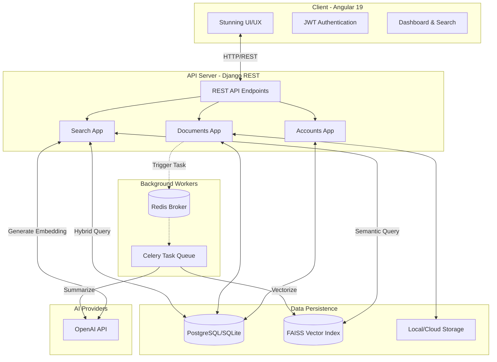

# AI-Powered Document Management System 🧠📁


An enterprise-grade, full-stack Document Management System (DMS) supercharged with Artificial Intelligence. This application allows organizations to securely store, version, and instantly retrieve documents using both precise keyword matching and deep-meaning **Semantic Vector Search**. 

Built with a highly scalable microservice-inspired architecture, the system automatically processes uploaded documents through OCR and utilizes LLMs to generate instant summaries and extract key business entities.

---

## ✨ Key Features

- **Hybrid Search Engine:** Combines traditional Full-Text Search (Django ORM/PostgreSQL) with Semantic Search (FAISS + OpenAI Embeddings) for unparalleled retrieval accuracy.
- **AI-Driven Insights:** Automatically generates intelligent summaries, calculates reading time, and extracts key entities (dates, organizations, concepts) from uploaded documents using LangChain and OpenAI.
- **Robust Document Versioning:** Seamlessly track document revisions, preserve history, and manage metadata.
- **Stunning UI/UX:** A modern, premium Angular 19 frontend utilizing Glassmorphism design, dark mode, smooth micro-animations, and responsive layouts.
- **Asynchronous Processing:** Long-running tasks like OCR and AI vector embeddings are offloaded to background workers using Celery and Redis to keep the UI lightning-fast.
- **Role-Based Access Control (RBAC):** Secure documents with granular permissions (Public, Department, Private) utilizing JWT Authentication.

---

## 🛠️ Technology Stack

### Frontend (Client)
* **Framework:** Angular 19 (Standalone Components)
* **State Management:** RxJS, Signals
* **UI/UX:** Angular Material, Custom Vanilla CSS (Glassmorphism, CSS Variables)
* **Routing:** Angular Router with Route Guards (AuthGuard)

### Backend (API Engine)
* **Framework:** Django & Django REST Framework (DRF)
* **Database:** PostgreSQL (Relational) / SQLite (Development fallback)
* **Vector Store:** FAISS (Facebook AI Similarity Search) for embedding storage
* **Task Queue:** Celery & Redis (Async task offloading)
* **Authentication:** SimpleJWT (JSON Web Tokens)

### AI & Processing
* **LLM Integration:** LangChain & OpenAI API (`gpt-4o-mini`, `text-embedding-3-small`)
* **Text Extraction:** PyTesseract (OCR for images), PyPDF2
* **Data Processing:** NumPy

---

## 🏗️ System Architecture

The project is structured into fully decoupled tiers communicating via REST APIs. When a document is uploaded, it is instantly available in the UI while heavy processing (OCR, Embedding, Summarization) runs asynchronously in the background.



### Search Flow Architecture

1. **User Query:** User submits a search (e.g., *"Q4 revenue projections"*).
2. **Vectorization:** The backend sends the query to OpenAI to generate a numerical vector embedding.
3. **Similarity Search:** The vector is compared against thousands of document chunks in the FAISS database using approximate nearest neighbors.
4. **Full-Text Match:** Simultaneously, a standard database query runs using PostgreSQL ORM filtering.
5. **Hybrid Merging:** Results from both engines are scored, merged, and returned to the frontend in milliseconds.

---

## 🚀 Local Development Setup

### Prerequisites
- Node.js (v18+)
- Python (v3.10+)
- Redis Server (for background tasks)
- Tesseract OCR (installed on system path)

### 1. Backend Setup
```bash
cd backend
python -m venv venv
source venv/Scripts/activate  # Or `venv/bin/activate` on Mac/Linux
pip install -r requirements.txt

# Environment Setup
cp .env.example .env
# --> Edit .env to add your OPENAI_API_KEY

# Database Migrations
python manage.py makemigrations
python manage.py migrate

# Create Superuser (Admin)
python manage.py createsuperuser

# Start Django Server
python manage.py runserver
```

### 2. Frontend Setup
```bash
cd frontend
npm install

# Start Angular Dev Server
npm start
```
The application will be available at `http://localhost:4200`.

---

## 👨‍💻 Author
**Nasim Uddin**  
*Full Stack & AI Engineer*

Demonstrating the power of combining traditional enterprise architecture with cutting-edge artificial intelligence to solve complex data retrieval problems.
