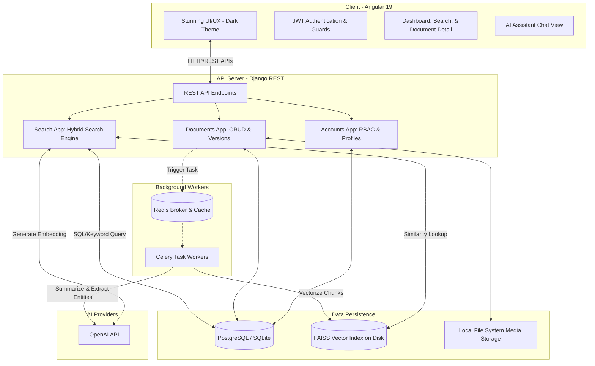

# AI-Powered Document Management System 🧠📁


An enterprise-grade, full-stack Document Management System (DMS) supercharged with Artificial Intelligence. This platform allows organizations to securely store, version, and instantly retrieve documents using precise keyword matching and **Semantic Vector Search**. 

Built with a Decoupled API-First Architecture, the system automatically processes uploaded documents through OCR and utilizes LLMs to generate instant summaries, extract key business entities, and support interactive multi-turn conversational Q&A over the entire document corpus.

---

## ✨ AI Contributions & Pipelines

This project showcases a production-ready integration of Generative AI and Information Retrieval (IR) patterns, highlighted by the following pipelines:

### 1. Retrieval-Augmented Generation (RAG) — AI Assistant
* **Conversational Q&A**: Uses LangChain and OpenAI `gpt-4o-mini` to answer natural language questions about uploaded files.
* **Context Retrieval Engine**: Custom chunk-retrieval pipeline matching FAISS embeddings (with a fallback database keyword search when embeddings are compiling) to feed relevant document contexts directly to the LLM.
* **Citations & References**: Returns the exact source document details along with the specific text chunks utilized to generate the AI response.
* **Multi-Turn Chat History**: Preserves conversation history locally on the frontend, allowing for seamless follow-up questions.

### 2. Semantic Vector Search
* **Text Chunking**: Dynamically splits extracted text into overlapping segments using LangChain's `RecursiveCharacterTextSplitter` (chunk size: 1000, overlap: 200).
* **OpenAI Embeddings**: Converts chunks into 1536-dimensional vector representations using `text-embedding-3-small`.
* **FAISS Indexing**: Indexes vector embeddings on the local file system using **FAISS** (Facebook AI Similarity Search) FlatIP indexes (Inner Product) for lightning-fast cosine similarity lookups.
* **Hybrid Merging Engine**: Executes a PostgreSQL full-text search and a FAISS semantic search concurrently, merging results via a custom python ranking system to balance exact-word matches and conceptual meaning.

### 3. Automated Summarization & Entity Extraction
* **Structured JSON Extraction**: Commands OpenAI to return structured summaries, key topics, and named entities (Dates, Organizations, Concepts) with relevance scores using JSON Schema validation.
* **Metadata Generation**: Automatically stores word counts, page counts, and mime-types, updating the document's AI status asynchronously.

### 4. Optical Character Recognition (OCR)
* **Image Text Processing**: Detects scanned documents and images (PNG, JPG, JPEG), routing them through **PyTesseract** to extract text for downstream vectorization and summary tasks.

---

## 🏗️ System Architecture

The application is structured into decoupled tiers communicating via REST APIs. Long-running OCR and AI generation processes are handled in the background to ensure the client-side remains fast.



---

## 🛠️ Technology Stack

### Frontend (Client)
* **Framework:** Angular 19 (Standalone Components)
* **State Management:** RxJS, Signals
* **UI/UX:** Angular Material 19, Custom Vanilla CSS (Glassmorphism, CSS Variables, Accent Gradients, Micro-animations)
* **Routing:** Angular Router with Route Guards (AuthGuard/RoleGuard)
* **Markdown:** `ngx-markdown` to render formatted AI responses and code blocks.

### Backend (API Engine)
* **Framework:** Django & Django REST Framework (DRF)
* **Database:** PostgreSQL / SQLite (Development fallback)
* **Vector Store:** FAISS (Facebook AI Similarity Search)
* **Task Queue:** Celery & Redis (Asynchronous task offloading)
* **Authentication:** SimpleJWT (JSON Web Tokens)
* **Python 3.14 Compatibility:** Implemented lazy imports in views and tasks to avoid startup-time langchain deprecation clashes.

---

## 🚀 Local Development Setup

### Prerequisites
- Node.js (v18+)
- Python (v3.10+)
- Redis Server (for background tasks)
- Tesseract OCR (installed on system path)

### 1. Backend Setup
```bash
cd backend
python -m venv venv
source venv/Scripts/activate  # Or `venv/bin/activate` on Mac/Linux
pip install -r requirements.txt

# Environment Setup
cp .env.example .env
# --> Edit .env to add your OPENAI_API_KEY

# Database Migrations
python manage.py makemigrations
python manage.py migrate

# Create Superuser (Admin)
python manage.py createsuperuser

# Start Django Server
python manage.py runserver
```

### 2. Frontend Setup
```bash
cd frontend
npm install

# Start Angular Dev Server
npm start
```
The application will be available at **`http://localhost:4200`**.

---

## 👨‍💻 Author
**Nasim Uddin**  
*Full Stack & AI Engineer*

Demonstrating the power of combining traditional enterprise architecture with cutting-edge artificial intelligence to solve complex data retrieval problems.
